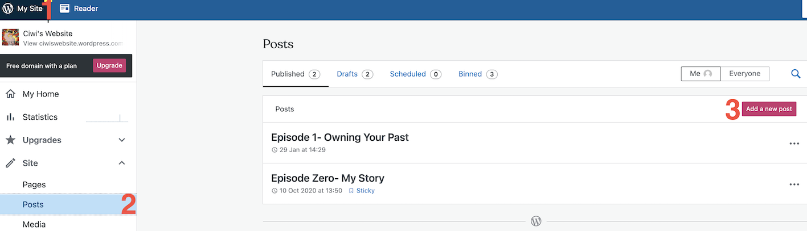
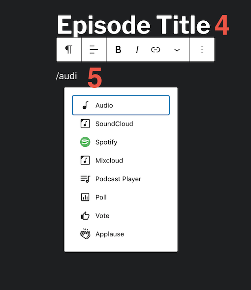
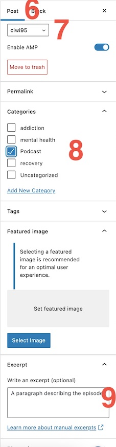
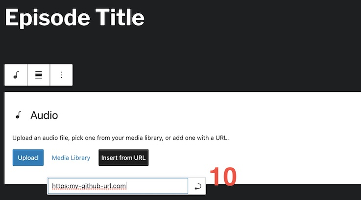

This is a script which will find any new videos of (Ciwi's Podcast)[https://www.youtube.com/channel/UCchHlGybrBFkP6qVxeaKMyg/videos?&ab_channel=CiaranMcCloy] from Youtube and download the audio track. Tracks will then be stored in the repo to be referenced by the (Wordpress site)[https://ciwiswebsite.wordpress.com/]. This augments the RSS feed used to publish the podcast on Spotify.

## Original Script
This script has been adapted for personal purposes. The more generalised original verion is located (here)[https://github.com/bardisty/ytdlrc].

## Running the script
Navigate to the directory of the getaudio script. Open a terminal window and type ./getaudio. Any new episodes of Ciwi's Podcast will be downloaded as audio to the new directory. They will be added to an archive list so they will not be re-downloaded. Push up to tje repo.

## Configuration
To change the source, amend the url in the get.list file

## Add audio file to the Wordpress RSS feed
Once the audio files are in the repo, they can be added to the website as a post.
Login in to the wordpress site and go into the settings. Click Posts on the left hand side and 'Add a new post'

Add the Episode title in the format 'Episode XX- Title of Episode'. Then below the title click /audio and select the audio dropdown option.

On the right pane, click on Post for the settings. Select the author. Select Podcast as the category (or it will NOT publish to Spotify). Write a brief excerpt describing the podcast episode.

Finally, click on insert from url and enter the url of the audio file, located on Github. In the repo, locate the audio file, right click the View Raw link and copy the link address- this will be what you need.

Publish and save all the changes and Spotify should pick up the new episode :)

